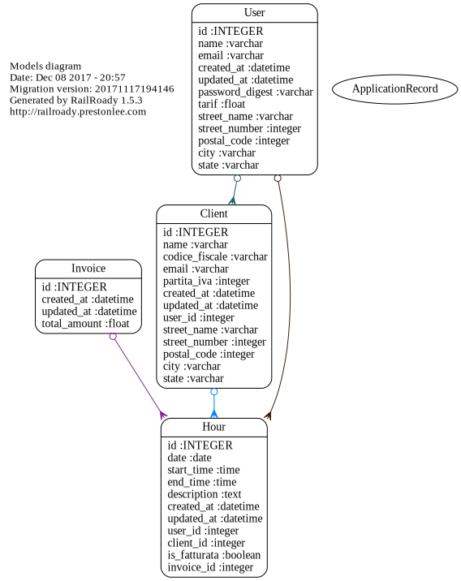

# 

__BillingFioi__ is a system used by users that need to keep track of their worked hours and create invoices based on that.

We got a *user* that can add his *clients* and record *hours* linked to a specific client.
Once he is ready, he can create an *invoice* and save it as *PDF*.
This system also lets you check all the *statistics* that you need in `/statistics` page, where you can visualise all data with tables and graphs.

## System Requirements
This web app is developed in [Ruby On Rails](http://rubyonrails.org/), so you need to [install](http://installrails.com/) it on your machine before installing our app.

This app uses:
> Rails 5.1.4

and
> Ruby 2.4.2

We tested it on:
- Ubuntu 17.10
- Mac OS X 10.13

## Installing

- Clone the repository using `git clone https://github.com/ImGere/AseFioi2017.git` :octocat:.
- Then from terminal type:
  - `cd Assignments/AppFatturazione` # to go into the app directory
  - `bundle install`  # to install all the gems :gem: that are needed in this app
  - `rails db:migrate` # to create the db and execute all the migrations
  - `rails server`  # to launch the webserver (Puma in this case) and to be able to run our app in your browser
- Now you are __ready to go__ you just need to sign up and start adding your hours and clients

## Tests

In order to run test you need to go into the project folder and run `rake cucumber`.
Note that you need to install a specific add-on on Mozilla Firefox to be able to check the *delete billed/unbilled hours* and *delete clients* 'cause bugs.

:gem: Tested with [`cucumber`](https://github.com/cucumber/cucumber-rails)

#### Coverage

You can check this application's test coverage by running `rake cucumber` and then open the `Assignments/AppFatturazione/coverage/index.html` that has been created, where there are useful information about the code that has been covered in the tests.

Currently when you run `rake cucumber` you get this label:
> Coverage report generated for Cucumber Features to /AseFioi2017/Assignments/AppFatturazione/coverage. 641 / 731 LOC **(87.69%)** covered.

:gem: Created with [`simplecov`](https://github.com/colszowka/simplecov)

## Application's structure

Here is the application's structure:

#### Controllers

#### Models

:gem: Created with [`railsroady`](https://github.com/preston/railroady)
____
## License
__BillingFioi__ is distribuited under the terms of the MIT License.

See [LICENSE](LICENSE) for datails.

## Copyright
Copyright :copyright: 2017 Gerevini Alessandro, Coba Paolo and Pietro Fabris.

____

## Team :rocket:
Developer name | Matricola
:---: | :---:
Alessandro Gerevini | 186052
Paolo Coba | 185013
Pietro Fabris | 188417

You can even check us in the `/about` page when you run it to get more information about us and who we are. :fireworks:
